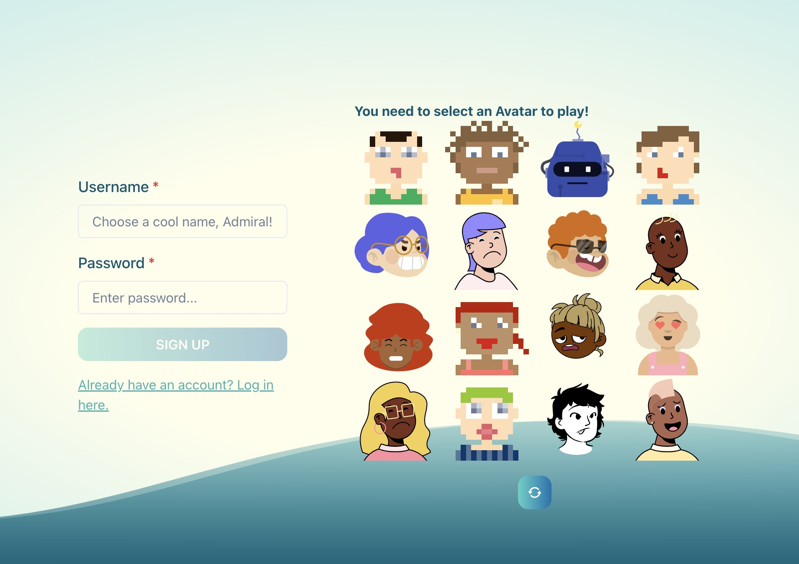
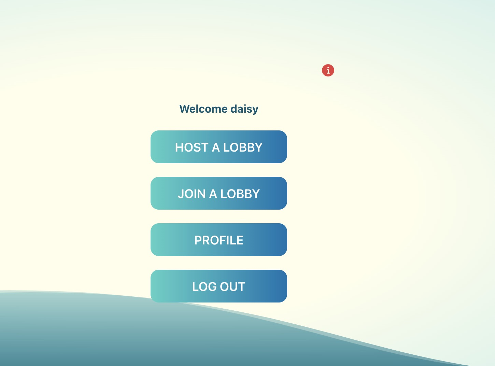
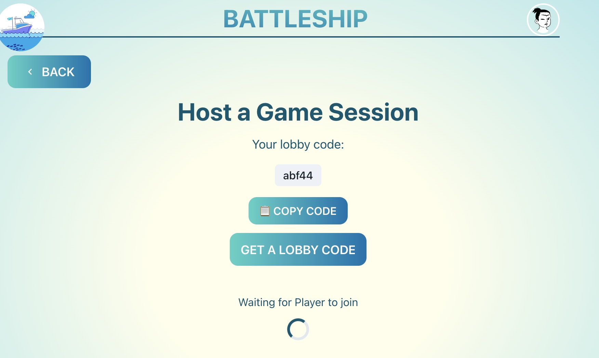
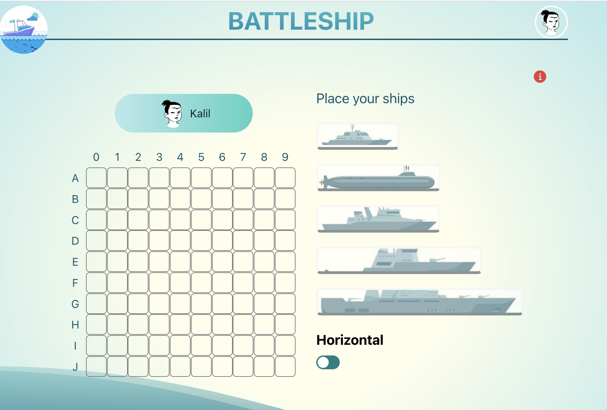
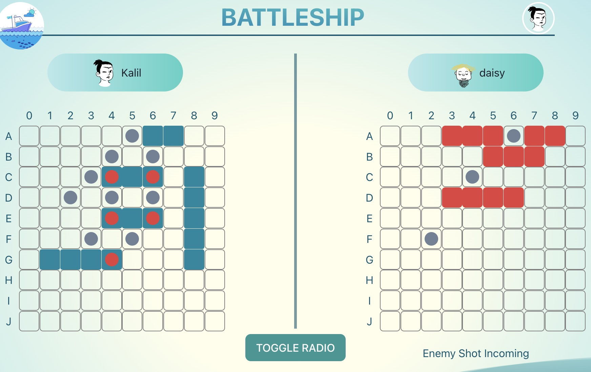
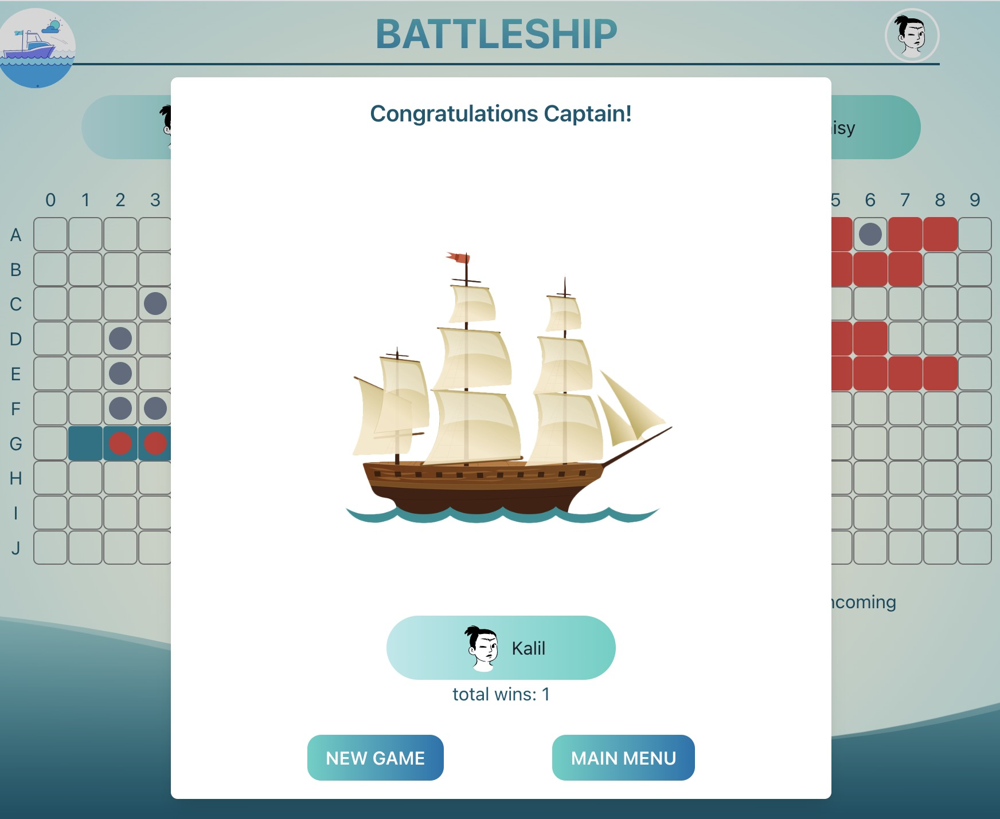
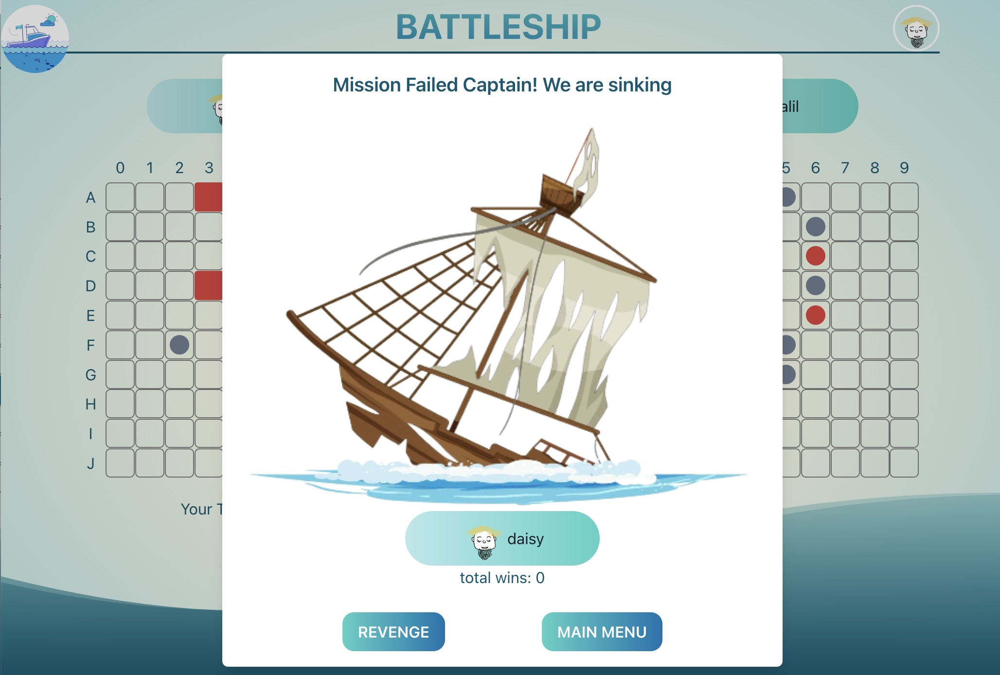

# Battleship Game - Client

## Introduction
Welcome to the Battleship Game project! This is a digital implementation of the classic strategy game where players engage in a battle of wits and strategy on the high seas. The game challenges players to strategically position their fleet of ships on a grid and tactically guess the locations of their opponent's ships.

This project aims to provide an enjoyable gaming experience while showcasing the use of modern web technologies. Whether you're a fan of the original board game or simply looking for a fun and engaging online game, Battleship Game offers an immersive experience that will keep you hooked.

## Technologies Used
* [React](https://react.dev/) - Front-end JavaScript library concerning the user interface
* [Vite](https://vitejs.dev/) - Front-end tool that is used for building fast and optimized web applications
* [Spring](https://spring.io/projects/spring-framework) - Framework that enables running JVM
* [Gradle](https://gradle.org/) - Build automation tool
* [STOMP](https://stomp-js.github.io/stomp-websocket/) - Used for Websockets
* [Dicebear API](https://www.dicebear.com/) - For creating Avatars

## High-Level Components
 
### Setup
The [Setup](https://github.com/sopra-fs23-group-11/sopra-fs23-group-11-client/blob/main/src/pages/Setup.jsx) is an essential part of the battleship game as it handles the preparation phase where players place their ships on the game board before the game starts. The component establishes a WebSocket connection using the Stomp.js library to enable real-time communication between players.

### Game
The [Game](https://github.com/sopra-fs23-group-11/sopra-fs23-group-11-client/blob/main/src/pages/Game.jsx) represents the main gameplay screen where the actual game is played between two players. It contains the logic and user interface for managing the game state, handling player actions, communicating with the server using websockets, rendering the game boards, displaying messages between players, and managing the overall flow of the game.
 
### GameContext
The [GameContext](https://github.com/sopra-fs23-group-11/sopra-fs23-group-11-client/blob/main/src/contexts/GameContext.jsx) file is an important component of our BattleShip game. It serves as a context provider for the game's state and functionality. It encapsulates the state related to the game, including the player's and enemy's boards, ships, turns, readiness, and game results. It also provides various functions to handle actions such as placing ships, shooting missiles, handling sunk ships, resetting the game state, and more.
 
### BattleShipBoard
The [BattleshipBoard](https://github.com/sopra-fs23-group-11/sopra-fs23-group-11-client/blob/main/src/components/BattleShipBoard.jsx) represents the game board where the players place their ships, track their own shots, and view the opponent's shots. It handles the rendering of the grid, cells, and ships on the board, as well as the interaction and logic related to placing ships, shooting at cells, and displaying the game state.

## Launch

### Getting Started
These instructions will get you a copy of the project up and running on your local machine for development and testing purposes. See [deployment](#deployment) for notes on how to deploy the project on a live system.

Clone the client-repository onto your local machine with the help of [Git](https://git-scm.com/downloads).

```git clone https://github.com/sopra-fs23-group-11/sopra-fs23-group-11-client.git```

### Prerequisites and Installation
For your local development environment, you will need Node.js. You can download it [here](https://nodejs.org). After downloading Node.js we have to install all other dependencies, including React, will get installed with the following command. Please run the command before starting the application for the first time.

```npm install```

If you want to see your development, run the following command:

```npm run dev```

Now [http://localhost:3000](http://localhost:3000) gets opened in a new browser tap, and you see your application. Do not forget to start the server for full functionality.

## Deployment
See this section about [deployment](https://vitejs.dev/guide/static-deploy.html) for more information
about deployment using Vite.

## Illustrations
<h3 align="center">
  <br>
  <a href="https://github.com/sopra-fs23-group-11"></a>
  <br>
  As a player, you can register or log in with an avatar.
  <br>
</h3>
<h3 align="center">
  <br>
  <a href="https://github.com/sopra-fs23-group-11"></a>
  <br>
  This is the main menu for users to navigate through.
  <br>
</h3>
<h3 align="center">
  <br>
  <a href="https://github.com/sopra-fs23-group-11"></a>
  <br>
  Host copies the lobby code and sends to the joiner.
  <br>
</h3>
<h3 align="center">
  <br>
  <a href="https://github.com/sopra-fs23-group-11"></a>
  <br>
  In the set-up page, the player needs to place ships onto the board.
  <br>
</h3>
<h3 align="center">
  <br>
  <a href="https://github.com/sopra-fs23-group-11"></a>
  <br>
  The two players take turns to shoot missiles, hit/miss/sunk show different icons.
  <br>
</h3>
<h3 align="center">
  <br>
  <a href="https://github.com/sopra-fs23-group-11"></a>
  <br>
  Winner page.
  <br>
</h3>
<h3 align="center">
  <br>
  <a href="https://github.com/sopra-fs23-group-11"></a>
  <br>
  Loser page.
  <br>
</h3>


## Roadmap
- Make Ships drag and drop at setup
- different Game modes
- different Shots
- Convert to IOS & Android native app

## Authors and Acknowledgment

### Authors
* **Kalil Subaan Buraaleh** - [kalilsub](https://github.com/kalilsub)
* **Nazek Olabi** - [Olabi98](https://github.com/Olabi98)
* **Louis Zürcher** - [LouisZuercher2](https://github.com/LouisZuercher2)
* **Qing Dai** - [qing-dai](https://github.com/qing-dai)
* **Nick Schlatter** - [Nickschlaedde](https://github.com/Nickschlaedde)

## License
This project is licensed under the Apache License 2.0 - see the [LICENSE](https://github.com/sopra-fs23-group-11/sopra-fs23-group-11-client/blob/main/LICENSE) file for details.
